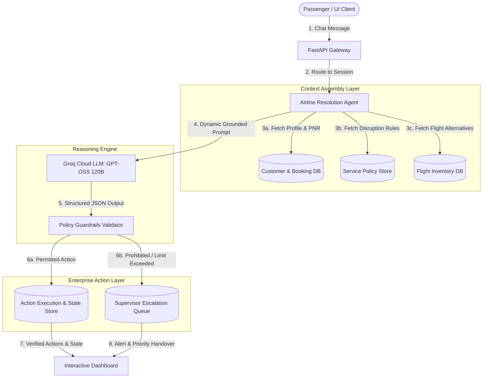
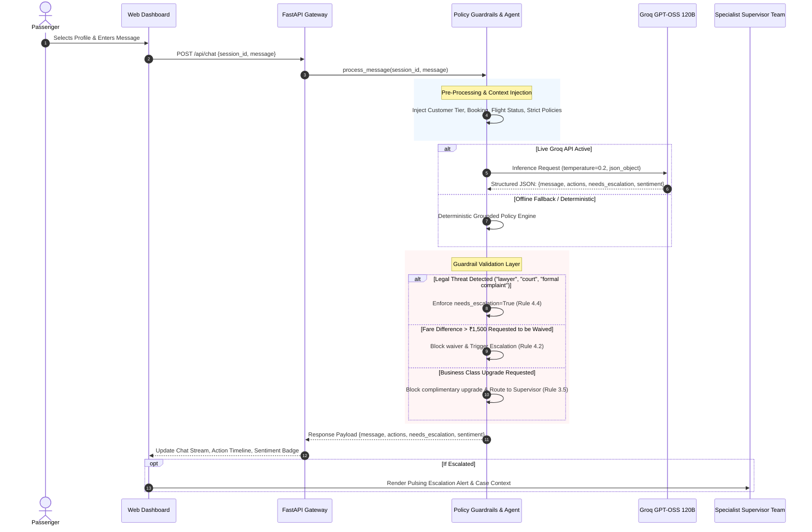

# SkyAssist — Architecture & Process Flow
**Autonomous Disruption Resolution Agent for SkyWay Airlines**

---

## 1. System Architecture Overview

SkyAssist is designed as a **Policy-Governed Agentic Architecture**. It bridges unstructured natural-language passenger interactions with deterministic enterprise business policies and structured transactional execution.



---

## 2. End-to-End Process Flow



---

## 3. Core Architectural Layers

### Layer 1: Passenger Experience & Interaction (Frontend)
- **Three-Panel Cockpit**:
  1. **Left Sidebar**: Real-time Passenger Selector displaying Loyalty Tiers (Gold, Silver, Platinum), PNRs, routes, and live disruption status.
  2. **Center Panel**: Conversational interface with empathetic responses, typing indicators, quick-evaluation prompt chips, and instant scenario triggers.
  3. **Right Panel**: Real-time operational context displaying ticket details, delay times, sentiment tracking, and a live timeline of automated policy actions.
- **Glassmorphism Design**: High-contrast, clean typography (`Inter`), airline navy palette with status indicators (Red for Cancelled, Amber for Delayed, Green for Confirmed).

### Layer 2: API Gateway & Session Lifecycle (FastAPI)
- **Asynchronous Execution**: High-throughput FastAPI application running with Uvicorn.
- **State Isolation**: Memory-isolated per-session conversation contexts.
- **Dynamic Configuration**: Supports real-time Groq API Key injection via `/api/set-key` without requiring server restarts.

### Layer 3: Reasoning & Grounded Policy Engine (Groq + GPT-OSS 120B)
- **Prompt Engineering**: The prompt strictly confines the model to the provided Data Pack. All rules, customer history, booking references, and departure dates (Wednesday, 23 September 2026) are injected.
- **Low Temperature (0.2)**: Ensures deterministic, non-hallucinatory compliance with airline disruption policies.
- **Strict JSON Mode**: Guarantees structured output format parsing directly into transactional actions.

### Layer 4: Hard Guardrails & Policy Interceptor
- **Defense in Depth**: Even if a large language model attempts to grant unauthorized compensation, the Python Guardrails layer programmatically validates actions against prohibited policies:
  1. **Prohibited Compensation Rule**: Rejects unapproved class upgrades or cash compensation beyond stated policies.
  2. **Fare Difference Cap**: Intercepts requests to waive fare differences exceeding ₹1,500 (e.g. Meher Kaur's ₹2,000 difference for SK-307) and triggers supervisor escalation.
  3. **Mandatory Legal Escalation**: Real-time pattern matching for keywords (`lawyer`, `legal action`, `court`, `formal complaint`, `consumer forum`) immediately routes the case to human specialists.
  4. **Hotel Stay Bounds**: Enforces that hotel accommodation covers **only the delayed hours** (e.g., 6 hours until departure) and never an unauthorized full-night stay.

---

## 4. State Transition Model

```
[Session Created]
        │
        ▼
[Disruption Context Loaded]
        │
        ▼
[Passenger Message Received]
        │
        ├── Legal / Formal Threat? ─────► [IMMEDIATE ESCALATION]
        │
        ├── Policy-Allowed Action? ─────► [EXECUTE ACTION] ──► [LOG TIMELINE] ──► [UPDATE CHAT]
        │
        └── Policy Limit Exceeded? ────► [PARTIAL ACTION] ──► [SUPERVISOR ESCALATION]
```
